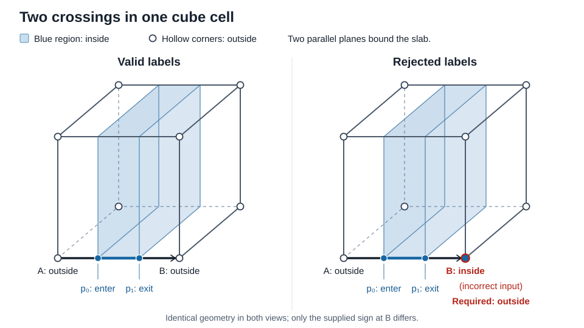

# Double-crossing grid connectivity

[中文说明](README.zh-CN.md)

## Purpose and place in a pipeline

This is a **connectivity building block for coarse-grid surface reconstruction**.
It connects known mesh/grid-edge intersections into paths on square faces and
closed boundary loops of cube cells. Every edge may have 0, 1, or 2 distinct
crossings. It is independent of MeshUtil's triangle decimator.

Ordinary corner-sign Marching Cubes cannot observe a thin sheet when a grid
edge enters and leaves it between two equally signed endpoints:

```text
outside ---- p0 ---- inside ---- p1 ---- outside
```

If only the corner samples are retained, this looks like an uncut edge. This
module preserves the two crossings as separate nodes and provides their local
connections, without subdividing the grid. The caller must already have the
crossing information, for example by intersecting an explicit input/GT mesh
with grid edges. The module cannot recover missing intersections from corner
signs or a sampled SDF alone.

The intended pipeline is:

```text
input mesh
  -> grid-edge intersections + consistent inside/outside corner labels
  -> this module: face paths and cube boundary loops
  -> geometric turn points + constrained loop triangulation
  -> output mesh
```

## What is implemented

- A self-contained, header-only C++17 API with standard-library dependencies.
- Checked encoding from explicit crossing counts; 3+ crossings on an edge
  raise `std::invalid_argument` rather than being silently truncated.
- All 82 parity-compatible face states, represented in 256 indexed slots.
- A 1,024-byte packed face array and an optional 348-byte D4 symmetry format.
- Cube boundary-loop assembly from six face lookups; no large 3D lookup file.
- Deterministic output for both table formats.
- A standalone Python generator, committed generated tables, and exhaustive
  structural tests. Python is only needed to regenerate/check tables.

This is **not an end-to-end mesher**. Mesh/grid intersection, duplicate-hit
resolution, corner classification, geometric yellow-point selection,
triangulation, normals, and output-file writing belong to the caller. No GPU
kernel or CUDA device API is supplied. No performance claim is made for the
complete reconstruction pipeline.

## Build and use

With MeshUtil as a source dependency:

```cmake
add_subdirectory(path/to/MeshUtil)
target_link_libraries(my_application PRIVATE MeshUtil::double_crossing)
```

Or build and install MeshUtil, then use the exported package:

```bash
cmake -S . -B temp_output/build -DCMAKE_BUILD_TYPE=Release -DMESHUTIL_BUILD_EXAMPLES=ON
cmake --build temp_output/build --parallel
ctest --test-dir temp_output/build --output-on-failure -j 1
cmake --install temp_output/build --prefix /your/install/prefix
```

```cmake
find_package(MeshUtil CONFIG REQUIRED)
target_link_libraries(my_application PRIVATE MeshUtil::double_crossing)
```

Set `CMAKE_PREFIX_PATH` to that install prefix when configuring the consumer.
For manual integration, copy the entire `include/meshutil` directory into your
include path; the public header includes its local generated detail header.

## Example: a thin sheet through one cube

```cpp
#include <meshutil/double_crossing.hpp>
#include <array>

namespace dc = meshutil::double_crossing;

// All 8 corners are outside. Each of the 4 x-directed edges crosses
// the two sides of one thin sheet. The other 8 edges have no crossings.
const std::array<unsigned, 12> counts{2, 2, 2, 2, 0, 0, 0, 0, 0, 0, 0, 0};
const auto cell = dc::cube_boundary_loops_from_counts(0, counts);
// cell.loops contains two separate four-node boundary loops.
// Resolve their positions from the corresponding edge hits before triangulating.
```

Run `temp_output/build/double_crossing_example` for a symbolic-node example.
It prints connections; it does not create a triangle mesh.

## Public API

All names are in `meshutil::double_crossing`.

| Function | Result |
| --- | --- |
| `encode_face(corner_mask, counts[4])` | Validated 8-bit face key |
| `lookup_face(corner_mask, pair_mask, storage)` | `FaceConnectivity` with up to four oriented paths |
| `lookup_face_from_counts(corner_mask, counts[4], storage)` | Same lookup with checked crossing counts |
| `encode_cube(corner_mask, counts[12])` | Validated 20-bit cube key |
| `cube_boundary_loops(corner_mask, pair_mask, storage)` | `CubeConnectivity` containing closed node cycles |
| `cube_boundary_loops_from_counts(corner_mask, counts[12], storage)` | Same assembly with checked crossing counts |
| `decode_cube_node(node_id)` | `CubeNode` describing an edge crossing or a face turn |

Count arguments are `std::array<unsigned, 4>` or `std::array<unsigned, 12>`.
`storage` defaults to `TableStorage::Packed`; use `TableStorage::Symmetry` for
the representative-template format. Invalid masks, incompatible counts, or
counts above two are rejected before narrowing to small integer types.

`FaceConnectivity::path_count` is the number of active elements of `paths`.
Each `FacePath` contains `start`, `end`, and `has_yellow`. Face paths are directed
with the inside region on their left in local face coordinates. Cube loops
use a deterministic traversal order, **not a guaranteed outward winding**;
orient the output triangles using the geometric surface information.

## Face coordinates and encoding

Corners are counterclockwise: `c0=(0,0)`, `c1=(1,0)`, `c2=(1,1)`,
`c3=(0,1)`. Edge `i` points from corner `i` to corner `(i+1)%4`.

```text
c3 <---- e2 ---- c2
 |               ^
e3               e1
 v               |
c0 ----- e0 ---> c1
```

`corner_mask` bit `i` is 1 for inside, 0 for outside. `pair_mask` bit `i`
indicates a pair of crossings on edge `i`:

- Different endpoint signs require exactly one crossing and a zero pair bit.
- Equal endpoint signs allow zero crossings (pair bit 0) or two (pair bit 1).

The face key is `corner_mask | (pair_mask << 4)`. Of the 256 bit patterns,
82 satisfy these constraints. The other **174 encodings are contradictory
inputs**: at least one edge has opposite endpoint signs and its pair bit set.
Each genuine crossing flips inside/outside, so two crossings require matching
endpoint signs. Such inputs raise `std::invalid_argument`.



The upper row has consistent labels. In the lower row, the supplied label at B
says inside even though the two crossings require outside. A face code with
any such edge is rejected; these are not additional valid geometric cases
missing from the table.

Face endpoint IDs are `2*edge+slot`;
`slot` is ordered by increasing parameter along the directed edge. A single
crossing uses slot 0. The second crossing uses slot 1.

Two triangle hits at one shared mesh edge are not automatically two distinct
surface crossings. Resolve duplicate hits, tangencies, and grid-corner events
before encoding. Do not use a tolerance that merges a genuinely thin pair.

## Cube coordinates and node IDs

Corner `i` has coordinates `(i&1, (i>>1)&1, (i>>2)&1)`. Public constants
`kCubeEdges` and `kCubeFaces` define the exact ordering:

```text
edges:
0:(0,1)  1:(2,3)  2:(4,5)  3:(6,7)    x-directed
4:(0,2)  5:(1,3)  6:(4,6)  7:(5,7)    y-directed
8:(0,4)  9:(1,5) 10:(2,6) 11:(3,7)    z-directed

faces:
0:(0,1,3,2) 1:(4,5,7,6) 2:(0,1,5,4)
3:(2,3,7,6) 4:(0,2,6,4) 5:(1,3,7,5)
```

The cube key is `corner_mask | (pair_mask << 8)`. All 36,450
parity-compatible configurations can be assembled from the face table.
An edge-crossing node has ID `2*edge+slot` (0..23); a symbolic face-turn node
has ID `24+4*face+local_yellow_slot` (24..47). `decode_cube_node` returns the
kind, edge/face index, and slot, so consumers do not need to unpack IDs.

Neighboring cells must share the same physical edge crossings and face turns.
Use globally consistent face keys and geometric turn selection when assigning
mesh vertex IDs. A local symbolic node ID is not a global mesh vertex ID.

## Yellow points: the unresolved geometry

When two endpoints of a path lie on the same grid edge, connecting them by
one straight segment would lie on that edge and lose the thin feature's turn.
`has_yellow=true` requests a point, or a short chain of points, inside the face:

```text
          q                  q is a geometric face turn
         / \
--------p0--p1--------       p0,p1 are the two edge crossings
```

In a GT-mesh workflow, candidate turns come from input-mesh edges intersecting
the grid face. Their selection needs the actual geometry. The symbolic marker
does not prescribe the face center, a coordinate, a normal, or the number of
geometric vertices used to represent that turn. Sharing the selected points
across adjacent cells is also the caller's responsibility.

## Compression and provenance

This implementation independently reconstructs the chosen templates in
Matthias Müller's [*Fast and Robust Tracking of Fluid Surfaces* (2009),
Figures 5/6 and §3.1–3.3](https://matthias-research.github.io/pages/publications/surfaceTracking.pdf).
It is not the author's source code or a claim to reproduce the complete fluid
simulation method. No external repository or research working directory is
needed at build time or runtime.

The 23 representative cases from columns 1, 2, 3, 4, 11, and 12 expand through
D4 rotations/reflections to all 82 face states. Mirrors reverse crossing slots
and directed paths. Inside/outside inversion is not used as a symmetry:
14 states change their chosen pairing under inversion.

The packed format uses 7 bits per path (3-bit start, 3-bit end, yellow flag),
3 bits for the path count, and one valid bit: 32 bits per indexed state.
The symmetry format uses 23 32-bit templates plus 256 8-bit map entries.
Those arrays occupy 1,024 B and 348 B respectively, excluding code/output
buffers; a binary that uses both modes may retain both sets of arrays.
The direct format avoids runtime remapping; neither format has a measured
GPU speed advantage here.

Regenerate or check the committed header with Python 3.9+:

```bash
python3 tools/generate_double_crossing_tables.py
python3 tools/generate_double_crossing_tables.py --check
```

The generator owns `include/meshutil/detail/double_crossing_tables.hpp`.
Edit representative cases/rules in the generator, then regenerate; do not
hand-edit the generated arrays.

## Guarantees and limits

The tests cover all 256 face encodings, both storage formats, oriented D4
transforms, explicit thin-feature cases, invalid input, and all 36,450
parity-compatible cube configurations. They check crossing coverage and
closed simple boundary cycles. Tests remain active in Release builds.

These are **discrete connectivity checks**, not proof that arbitrary input
geometry yields a manifold, intersection-free, topology-preserving mesh.
The original method targets a restricted class of thin features. Multiple
geometric configurations can share the same signs and crossing counts.
Components entirely inside a cell without grid-edge crossings are not encoded.
Final triangulation depends on coordinates and face constraints.

More than two crossings are intentionally unsupported. This module does not
average odd crossings or keep only the outermost even crossings: such choices
would merge or delete input features and must be made explicitly upstream.
