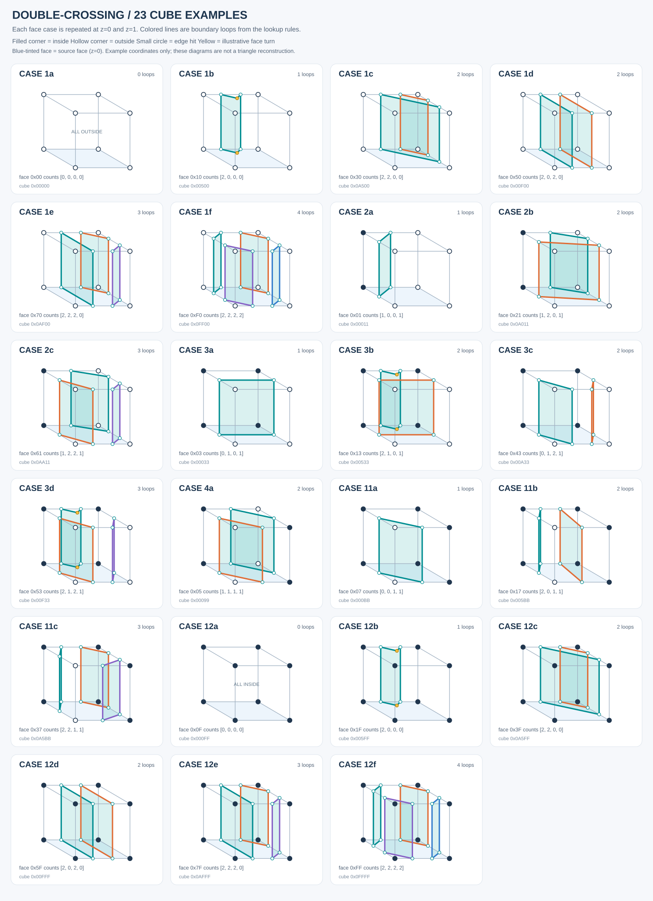

# 23 个 case 的示例立方体

[打开交互浏览页](index.html) · [查看完整总览](overview.svg) · [示例数据](cases.json)

[174 个非法输入图例](../invalid/README.md) · [7 组内外翻转后的连接差异](../conflicts/README.md) · [下载分类 PDF 图册](../../../output/pdf/MeshUtil_double_crossing_cases_and_conflicts.pdf)

本目录为 `tools/generate_double_crossing_tables.py` 中全部 **23 个命名代表模板**各画一个立方体。
这些模板原本是二维面 case，通过旋转、镜像展开为 82 个面状态；本图集不是全部 36,450 个三维编码的枚举。

`index.html` 可在浏览器中直接打开，支持拖动旋转、切换 case、筛选、节点编号、缩放和示意曲面开关；无需安装依赖或联网。
每个 SVG 均可单独打开、放大、插入文档。



## 每个示例如何构造

把源面复制到 `z=0` 和 `z=1`，对应角点符号及边交点数保持一致；四条 z 方向边的交点数为 0。
六个面一起按原有查表规则连接，得到完整立方体边界环。

- 深色实心角点：内部；空心角点：外部。
- 小空心点：网格边与曲面的交点。
- 黄色点：面内转折点，其坐标为示意值。
- 彩色线：闭合边界环；不同颜色区分不同环。
- 浅蓝面：`z=0` 的基准面。半透明色块为沿 z 延伸的示意曲面。

局部面角点 `c0,c1,c2,c3` 对应立方体角点 `0,1,3,2`，上面对应 `4,5,7,6`。
单交点位于边中点，双交点位于边参数 `0.32` 和 `0.68`；黄色点从所在边向面内偏移 `0.20`。
这是一种便于观察的几何延伸，不是唯一三维解，也不是 GT mesh 的重建结果。
`1a`（全外部）和 `12a`（全内部）都没有边界环，图中保留完整空立方体。

## 独立图片

| 内部角点分组 | Case 图片 |
| --- | --- |
| 0 个 | [1a](case-1a.svg) · [1b](case-1b.svg) · [1c](case-1c.svg) · [1d](case-1d.svg) · [1e](case-1e.svg) · [1f](case-1f.svg) |
| 1 个 | [2a](case-2a.svg) · [2b](case-2b.svg) · [2c](case-2c.svg) |
| 2 个，相邻 | [3a](case-3a.svg) · [3b](case-3b.svg) · [3c](case-3c.svg) · [3d](case-3d.svg) |
| 2 个，对角 | [4a](case-4a.svg) |
| 3 个 | [11a](case-11a.svg) · [11b](case-11b.svg) · [11c](case-11c.svg) |
| 4 个 | [12a](case-12a.svg) · [12b](case-12b.svg) · [12c](case-12c.svg) · [12d](case-12d.svg) · [12e](case-12e.svg) · [12f](case-12f.svg) |

## 重新生成

在仓库根目录执行（Python 3.9+，仅标准库）：

```bash
python tools/render_double_crossing_cases.py
python tools/render_double_crossing_cases.py --check
```

生成器同时更新 23 张独立 SVG、`overview.svg`、`index.html` 和 `cases.json`。
修改布局应编辑 `tools/render_double_crossing_cases.py` 或 `tools/templates/double_crossing_gallery.html`；
连接规则来自原有表生成器，不应手动修改生成文件。

生成时验证六面节点度数、交点完整覆盖、闭环和示意曲面的边界一致性。
示例数据还已与 C++ 公共接口逐节点核对，包括黄色节点编号和两个表存储模式；原有 36,450 个立方体结构测试通过。
